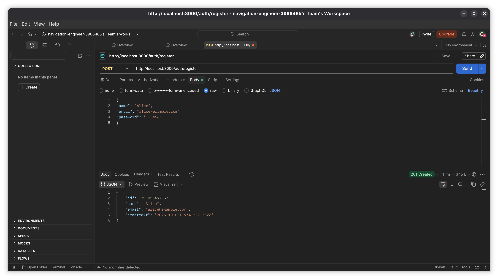
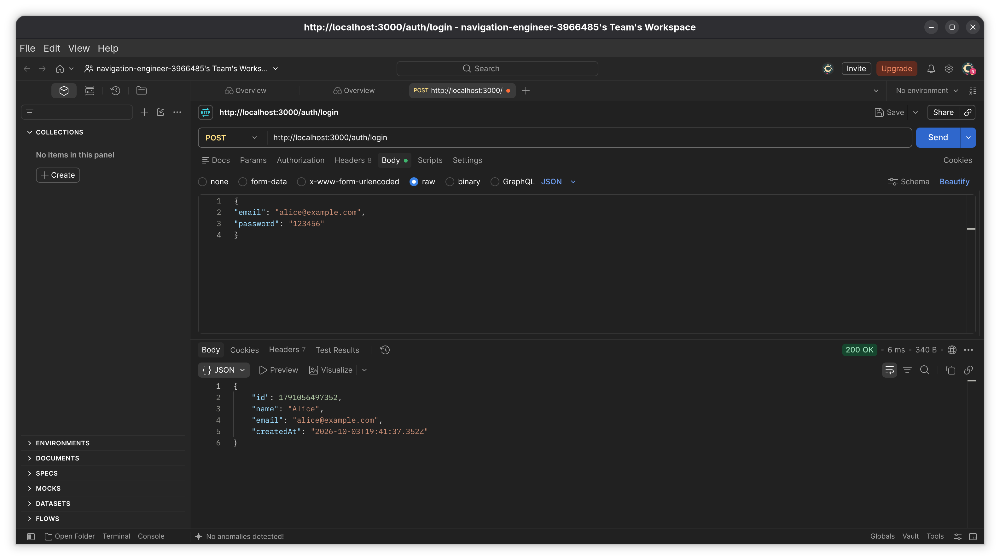
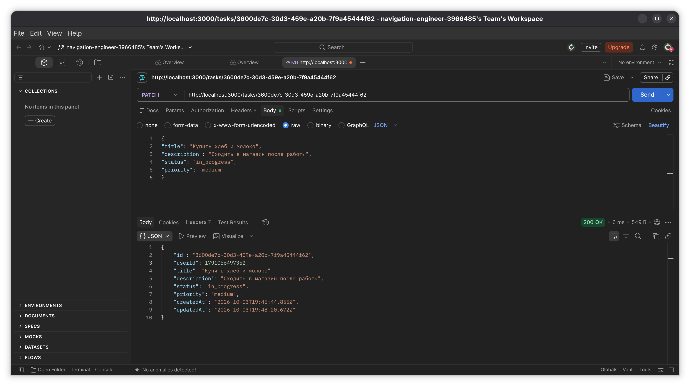
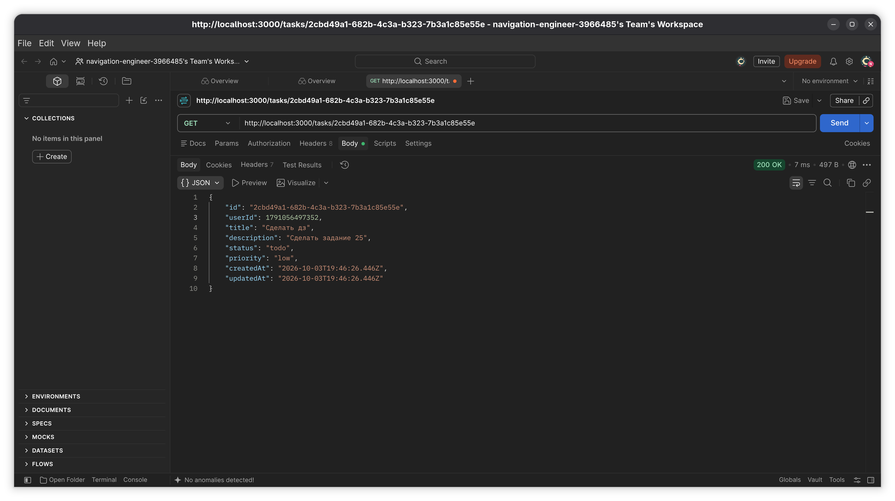

<h1 class="center">TaskFlow API</h1>

<nav>
  

    <a href="#uk">Українська</a> |
    <a href="#en">English</a>
  

</nav>

<h2 class="center">⚡ Команди для запуску та перевірки</h2>
<table>
  <tr>
    <th>Команда</th>
    <th>Що робить</th>
    <th>Для копіювання</th>
  </tr>
  <tr>
    <td><strong>Install</strong></td>
    <td>Встановлення залежностей</td>
    <td><pre><code>npm install</code></pre></td>
  </tr>
  <tr>
    <td><strong>Start</strong></td>
    <td>Запуск API</td>
    <td><pre><code>npm start</code></pre></td>
  </tr>
  <tr>
    <td><strong>Check</strong></td>
    <td>Перевірка роботи сервера</td>
    <td><pre><code>http://localhost:3000</code></pre></td>
  </tr>
</table>

<section id="uk">
  <h1>TaskFlow API</h1>

  <h2 id="goals-uk">🎯 Цей проєкт створено з метою:</h2>
  <ul>
    <li>Розробити REST API для управління особистими задачами;</li>
    <li>Навчитися працювати з <strong>Express</strong> та <strong>Node.js</strong>;</li>
    <li>Зберігати дані асинхронно у JSON-файлах через <strong>node:fs/promises</strong>;</li>
    <li>Розібратися в архітектурі <strong>Router → Handler → Service → Repository → JSON</strong>;</li>
  </ul>

  <h2 id="team-uk">👥 Склад команди розробників проєкту:</h2>
  <ul>
    <li><a href="https://github.com/Vi1704ca">Тимошенко Вікторія</a> — Team Lead / Програміст</li>
    <li><a href="https://github.com/Remsha-Illia">Ремша Ілля</a> — Програміст</li>
    <li><a href="https://github.com/RomanRedkin">Редькін Роман</a> — Програміст</li>
    <li><a href="https://github.com/OlehNedilko">Неділько Олег</a> — Програміст</li>
  </ul>

  <h2>🧭 Навігація / зміст файлу:</h2>
  <ul>
    <li><a href="#goals-uk">Мети проєкту</a></li>
    <li><a href="#team-uk">Склад команди</a></li>
    <li><a href="#technologies-uk">Використані технології</a></li>
    <li><a href="#project-launch-uk">Запуск проєкту</a></li>
    <li><a href="#api-uk">API endpoints</a></li>
    <li><a href="#structure-uk">Структура проєкту</a></li>
    <li><a href="#summary-uk">Висновок</a></li>
  </ul>

  <h2 id="technologies-uk">⚒️ Використані технології:</h2>
  <ul>
    <li><a href="https://nodejs.org/">Node.js</a></li>
    <li><a href="https://expressjs.com/">Express.js</a></li>
    <li><a href="https://developer.mozilla.org/en-US/docs/Web/JavaScript">JavaScript / TypeScript</a></li>
    <li><a href="https://nodejs.org/api/fs.html">node:fs/promises</a></li>
    <li><a href="https://www.npmjs.com/">npm</a></li>
  </ul>

  <h2 id="project-launch-uk">📂 Розгортання проєкту:</h2>
  <h3>Клонування проєкту:</h3>
  <pre><code>git clone https://github.com/Vi1704ca/TaskFlowApi.git
cd TaskFlowApi</code></pre>

  <h3>Встановлення залежностей:</h3>
  <pre><code>npm install</code></pre>

  <h3>Запуск проєкту:</h3>
  <pre><code>npm start</code></pre>

  <h3>Перевірка сервера:</h3>
  <pre><code>http://localhost:3000</code></pre>

  <h2 id="api-uk">📡 API endpoints</h2>

  <h3>Авторизація та користувачі</h3>
  <table>
    <tr>
      <th>Method</th>
      <th>Endpoint</th>
      <th>Опис</th>
    </tr>
    <tr>
      <td>POST</td>
      <td>/auth/register</td>
      <td>Реєстрація користувача</td>
    </tr>
    <tr>
      <td>POST</td>
      <td>/auth/login</td>
      <td>Вхід користувача</td>
    </tr>
    <tr>
      <td>GET</td>
      <td>/users/:id</td>
      <td>Отримати користувача за id</td>
    </tr>
  </table>

  <h3>Задачі</h3>
  <table>
    <tr>
      <th>Method</th>
      <th>Endpoint</th>
      <th>Опис</th>
    </tr>
    <tr>
      <td>POST</td>
      <td>/tasks</td>
      <td>Створити задачу</td>
    </tr>
    <tr>
      <td>GET</td>
      <td>/tasks</td>
      <td>Отримати список задач з фільтрами userId, status, priority</td>
    </tr>
    <tr>
      <td>GET</td>
      <td>/tasks/:id</td>
      <td>Отримати задачу за id</td>
    </tr>
    <tr>
      <td>PATCH</td>
      <td>/tasks/:id</td>
      <td>Оновити задачу</td>
    </tr>
    <tr>
      <td>DELETE</td>
      <td>/tasks/:id</td>
      <td>Видалити задачу</td>
    </tr>
  </table>

  <h3>Приклад запиту 1: Реєстрація</h3>
  <pre><code>{
  "name": "Alice",
  "email": "alice@example.com",
  "password": "123456"
}</code></pre>
  

  <h3>Приклад запиту 2: Логін</h3>
  <pre><code>{
  "email": "alice@example.com",
  "password": "123456"
}</code></pre>
  

  <h3>Приклад запиту 3: Створення задачі</h3>
  <pre><code>{
  "userId": 1,
  "title": "Купити хліб",
  "description": "Піти в магазин після роботи",
  "status": "todo",
  "priority": "high"
}</code></pre>
  

  <h2 id="structure-uk">⚙️ Структура проєкту:</h2>
  <pre><code>project/
├── data/
│   ├── users.json
│   └── tasks.json
├── src/
│   ├── app.ts
│   ├── domain/
│   ├── repositories/
│   ├── services/
│   └── transport/
├── package.json
├── tsconfig.json
└── README.md</code></pre>
  

  <h2 id="summary-uk">Висновок:</h2>
  
Цей проєкт створений для практики розробки REST API, роботи з JSON-файлами та розуміння базової архітектури backend-сервісу. Основна мета — навчитися правильно розділяти логіку на шари, зберігати дані між перезапусками сервера та реалізувати API для реального застосування.

  
<a href="#uk">Наверх</a> | <a href="#en">English version</a>

</section>

<section id="en">
  <h1>TaskFlow API</h1>

  <h2 id="goals-en">🎯 This project was created with the following goals:</h2>
  <ul>
    <li>Develop a REST API for managing personal tasks;</li>
    <li>Learn how to work with <strong>Express</strong> and <strong>Node.js</strong>;</li>
    <li>Store data asynchronously in JSON files using <strong>node:fs/promises</strong>;</li>
    <li>Understand the architecture <strong>Router → Handler → Service → Repository → JSON</strong>;</li>
  </ul>

  <h2 id="team-en">👥 Project development team:</h2>
  <ul>
    <li><a href="https://github.com/Vi1704ca">Viktoriia Tymoshenko</a> — Team Lead / Programmer</li>
    <li><a href="https://github.com/Remsha-Illia">Illia Remsha</a> — Programmer</li>
    <li><a href="https://github.com/RomanRedkin">Roman Redkin</a> — Programmer</li>
    <li><a href="https://github.com/OlehNedilko">Oleh Nedilko</a> — Programmer</li>
  </ul>

  <h2>🧭 File navigation / table of contents:</h2>
  <ul>
    <li><a href="#goals-en">Project goals</a></li>
    <li><a href="#team-en">Development team</a></li>
    <li><a href="#technologies-en">Technologies used</a></li>
    <li><a href="#project-launch-en">Project launch</a></li>
    <li><a href="#api-en">API endpoints</a></li>
    <li><a href="#structure-en">Project structure</a></li>
    <li><a href="#summary-en">Conclusion</a></li>
  </ul>

  <h2 id="technologies-en">⚒️ Technologies used:</h2>
  <ul>
    <li><a href="https://nodejs.org/">Node.js</a></li>
    <li><a href="https://expressjs.com/">Express.js</a></li>
    <li><a href="https://developer.mozilla.org/en-US/docs/Web/JavaScript">JavaScript / TypeScript</a></li>
    <li><a href="https://nodejs.org/api/fs.html">node:fs/promises</a></li>
    <li><a href="https://www.npmjs.com/">npm</a></li>
  </ul>

  <h2 id="project-launch-en">📂 Project deployment:</h2>
  <h3>Clone the project:</h3>
  <pre><code>git clone https://github.com/Vi1704ca/TaskFlowApi.git
cd TaskFlowApi</code></pre>

  <h3>Install dependencies:</h3>
  <pre><code>npm install</code></pre>

  <h3>Run the project:</h3>
  <pre><code>npm start</code></pre>

  <h3>Check the server:</h3>
  <pre><code>http://localhost:3000</code></pre>

  <h2 id="api-en">📡 API endpoints</h2>

  <h3>Authentication and users</h3>
  <table>
    <tr>
      <th>Method</th>
      <th>Endpoint</th>
      <th>Description</th>
    </tr>
    <tr>
      <td>POST</td>
      <td>/auth/register</td>
      <td>Register a user</td>
    </tr>
    <tr>
      <td>POST</td>
      <td>/auth/login</td>
      <td>Log in a user</td>
    </tr>
    <tr>
      <td>GET</td>
      <td>/users/:id</td>
      <td>Get a user by id</td>
    </tr>
  </table>

  <h3>Tasks</h3>
  <table>
    <tr>
      <th>Method</th>
      <th>Endpoint</th>
      <th>Description</th>
    </tr>
    <tr>
      <td>POST</td>
      <td>/tasks</td>
      <td>Create a task</td>
    </tr>
    <tr>
      <td>GET</td>
      <td>/tasks</td>
      <td>Get tasks with userId, status, priority filters</td>
    </tr>
    <tr>
      <td>GET</td>
      <td>/tasks/:id</td>
      <td>Get a task by id</td>
    </tr>
    <tr>
      <td>PATCH</td>
      <td>/tasks/:id</td>
      <td>Update a task</td>
    </tr>
    <tr>
      <td>DELETE</td>
      <td>/tasks/:id</td>
      <td>Delete a task</td>
    </tr>
  </table>

  <h3>Request example 1: Register</h3>
  <pre><code>{
  "name": "Alice",
  "email": "alice@example.com",
  "password": "123456"
}</code></pre>
  

  <h3>Request example 2: Login</h3>
  <pre><code>{
  "email": "alice@example.com",
  "password": "123456"
}</code></pre>
  

  <h3>Request example 3: Create task</h3>
  <pre><code>{
  "userId": 1,
  "title": "Buy bread",
  "description": "Go to the store after work",
  "status": "todo",
  "priority": "high"
}</code></pre>
  

  <h2 id="structure-en">⚙️ Project structure:</h2>
  <pre><code>project/
├── data/
│   ├── users.json
│   └── tasks.json
├── src/
│   ├── app.ts
│   ├── domain/
│   ├── repositories/
│   ├── services/
│   └── transport/
├── package.json
├── tsconfig.json
└── README.md</code></pre>
  

  <h2 id="summary-en">Conclusion:</h2>
  
This project was created to practice building a REST API, working with JSON files, and understanding the basics of backend architecture. The main goal is to properly separate logic into layers, keep data after server restarts, and implement a real-world API for task management.

  
<a href="#uk">Наверх</a> | <a href="#en">English version</a>

</section>
